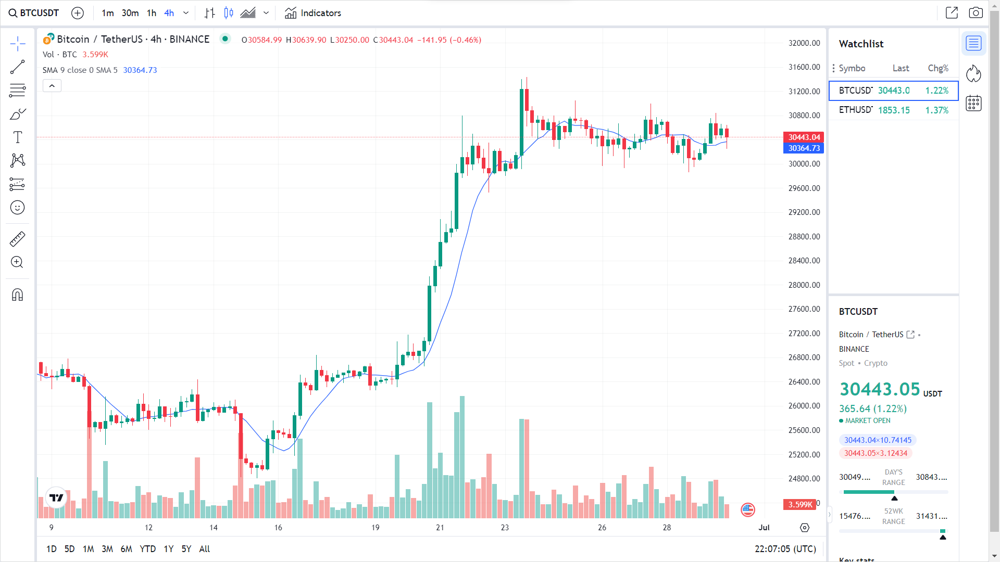

# Tradingview-Widget-2

A customizable TradingView widget built with HTML, CSS, and JavaScript for displaying financial charts and market data.

## Description

This project provides a simple HTML page that embeds a TradingView widget, allowing users to view interactive charts for cryptocurrencies and other financial instruments. The widget is configured to display the Bitcoin (BTC/USD) chart by default, with additional features like watchlist, studies, and calendar.

## Features

- **Interactive Charts**: Real-time charts for Bitcoin and other symbols.
- **Watchlist**: Pre-configured watchlist including Ethereum (ETH/USD) and Binance Coin (BNB/USD).
- **Technical Studies**: Includes Exponential Moving Average (EMA) study.
- **Customizable**: Easy to modify symbol, theme, and other parameters in the JavaScript code.
- **Responsive**: Autosizes to fit the container.

## Usage

1. Clone the repository:
   ```bash
   git clone https://github.com/BinaryVortex/Tradingview-Widget-2.git
   ```

2. Open `index.html` in your web browser.

For embedding in a website, copy the HTML code from `index.html` into your page.

## Configuration

The widget is configured in the JavaScript code within `index.html`. Key options include:

- `symbol`: The default symbol (e.g., "BITSTAMP:BTCUSD").
- `interval`: Chart interval (e.g., "D" for daily).
- `theme`: "light" or "dark".
- `watchlist`: Array of symbols to include.
- `studies`: Array of studies to apply.

Modify these values as needed.

## Screenshot



## Requirements

- A web browser with JavaScript enabled.
- Internet connection for live data from TradingView.

## License

This project is open-source. Please check TradingView's terms of service for widget usage.

## Contributing

Feel free to submit issues or pull requests for improvements.